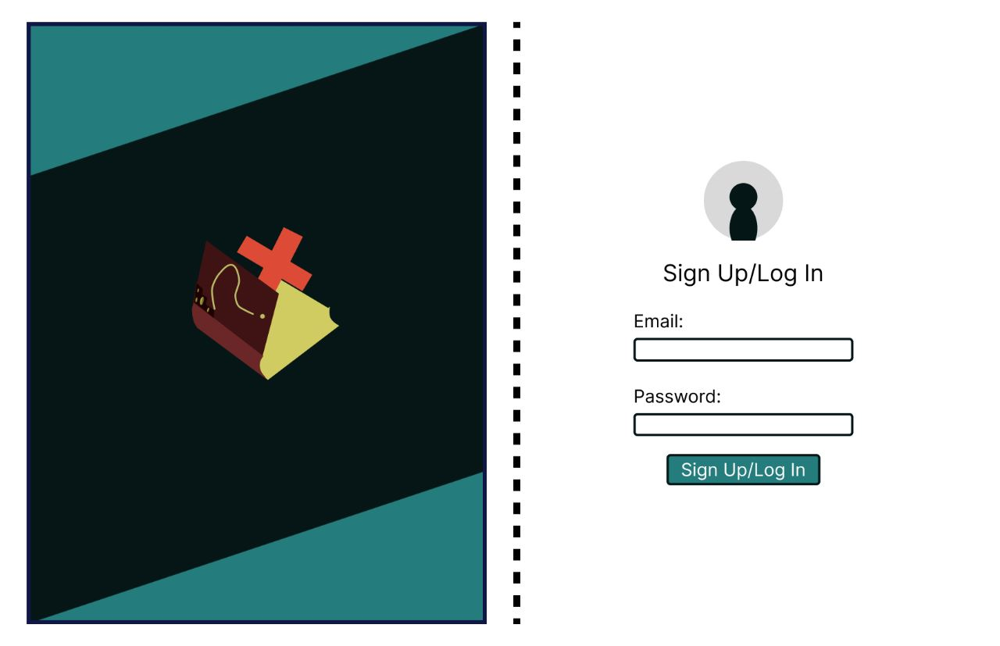
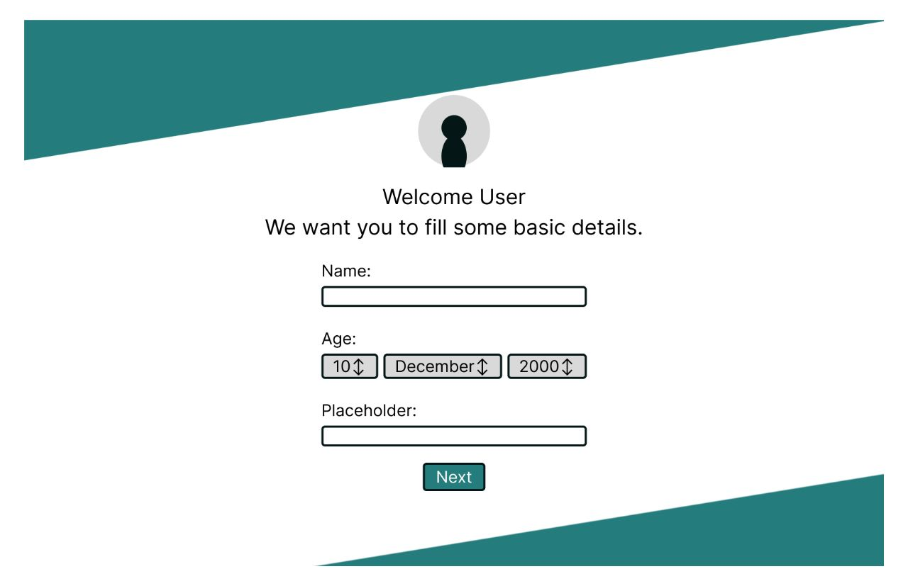
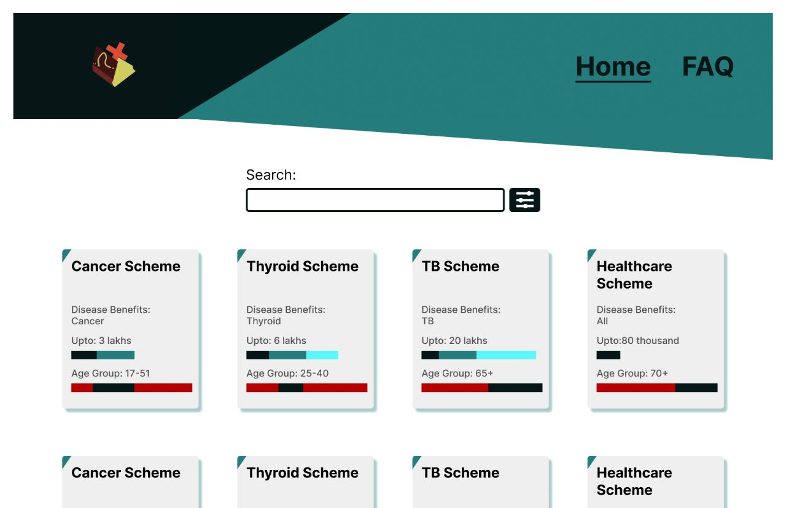
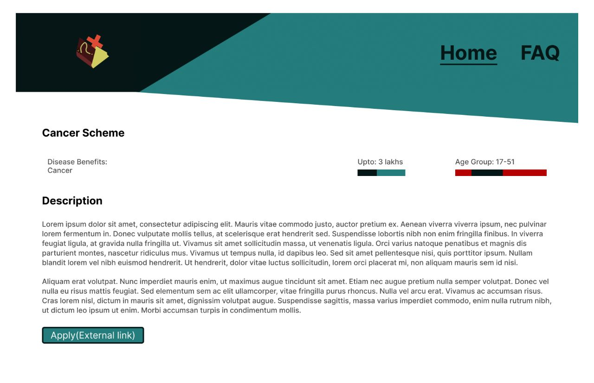

# Problem Statement:-
## Connecting Beneficiaries of Government Health Schemes
We have to craete a platform to connect the beneficiaries of government health schemes in different states and answer their queries without any telephonic conversation.

## Explanation of Problem Statement:-
<ul>
<li>In India, although there are many currently running National as well as State health schemes, there exists no formal directory or database of all of them given in an easy-to-understand and user-friendly way.</li>
 
<li>This causes funds to be left unutilized, resulting in the possible loss of legitimate beneficiaries, and ultimately, government health schemes are not able to reach the grassroot level, defeating the entire purpose of social welfare.</li>
</ul>

# Our Approach:-
<ul>
<li>We approach this by first going through the replies of previous PILs and government documents to collect all the data of all presently running schemes by each government body.</li>
 
  <li>Then we compile this data into an easy-to-understand list of schemes along with the data on who this is intended for, i.e., the criteria to avail it.</li>
   
  <li>Then we build a website with the entire list of schemes along with the link to apply for each scheme, this also includes filters so a beneficiary can filter the list by his or her present status. This removes the need to scour through the entire list manually to search for the schemes that apply to you.</li>
   
  <li>The website also include an authentication and registration system where users input their details and the system automatically shows the schemes relevant to them, this automatic filtering can be disabled too by the user.</li>
  </ul>

# Solution:-
## Jeevan Rakshak:-
We are solving this by building a website to connect the beneficiaries of government health schemes in different states and answer their queries without any telephonic conversation.

# Tech Stack We Have Used:-
<ul>
  <li>
  We are using React on the Frontend and Firebase along to serve and connect to the database.
  </li>

</ul>

# How It Will Impact the Society:-
<ul>
  <li>
    This will lead to a higher penetration of government health schemes and a higher utilisation of allotted funds, leading to an improvement in quality of life and social welfare.
  </li>
   
  <li>
    This also results in the standardisation of the scheme data and makes it available in a single place.
  </li>
</ul>

# About Me :-
<ul>
  <li>
   Aman Chandra
    <ul>
      <li>ECE 2020-24, IIIT Ranchi</li>
    </ul> 
  </li>
   
</ul>

# Glimpses of our Prototype:-
## Web:-
### Deployed at http://www.jeevanrakshak.web.app/

# Upcoming Features:-
<ul>
  <li>
    Once this system is in place, we would build(already built without other endpoint) a complete FAQ system along with pre-populated standard questions and answers, option to post new questions and an ever-growing list of previously answered questions so next time people can refer to that previous query.
  </li>
   
  <li>
    Although this is just a prototype,we will try our best to scale it to a larger level so that it will create a huge impact in the society.
  </li>
  </ul>
